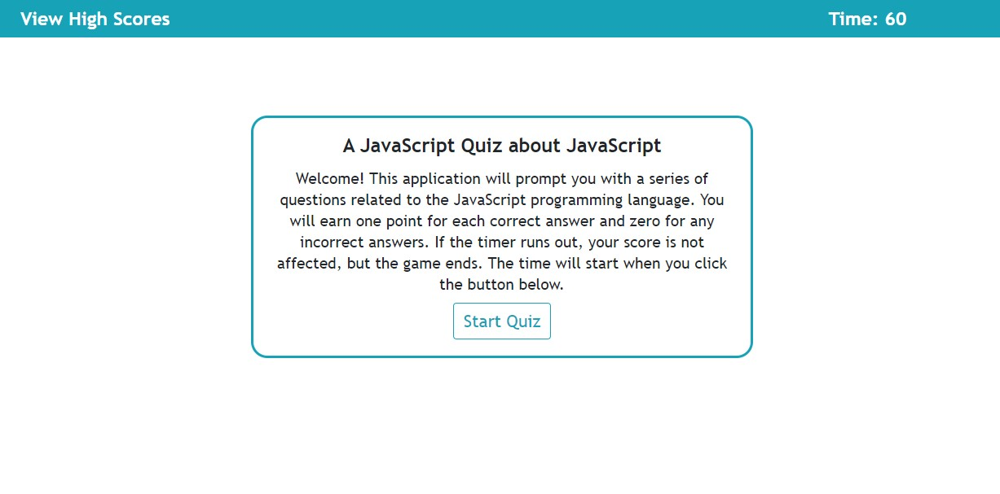

# JavaScript Quiz

A JS-driven quiz about JS. Users can answer questions about JS and then add their name to a locally-stored table of high scores.

## Usage
This webpage is hosted on GitHub pages and can be accessed (here.)[https://jkohrt7.github.io/Javascript_Quiz/] One point is awarded for each correct answer; answering incorrectly will deduct 10 seconds from the timer. The quiz ends when the timer runs out or all the questions are answered.

## Roadmap
Additional questions will be added before any other major work is done on the project. Once I've learned a bit more about MongoDB, the scores will be stored online rather than in localStorage.

## Authors and acknowledgements
This project was created by Jared Kohrt; credit to (Bootstrap 4)[https://getbootstrap.com/] for the style of the start/submit/reset buttons.

## License
[MIT](https://choosealicense.com/licenses/mit/)